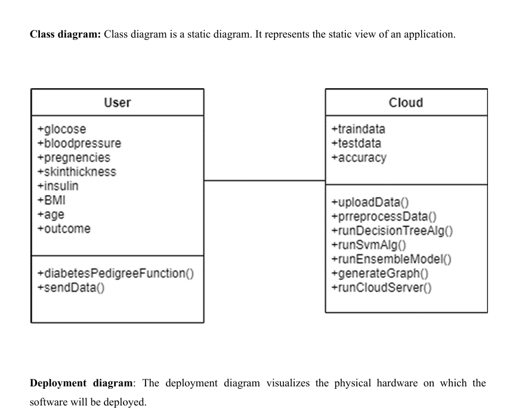
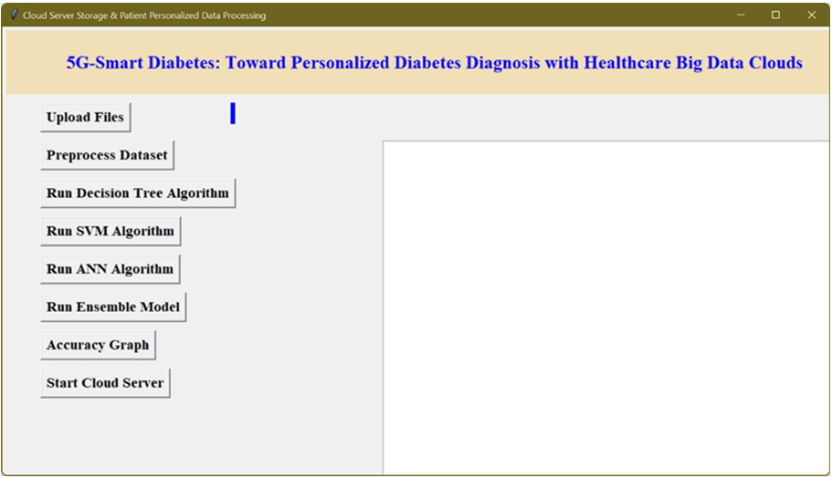

<h1> Diabetes_Type-2 </h1>
<li><h2>Team members</h2>
 <ol>Nithish Jaligapu</ol>
<ol>Rishitha</ol>
<ol>Shiva kumar</ol>
<ol>siddharth</ol></li>

<pre>The biggest strength of Python is huge collection of standard library which can be used for the
 following
● · MachineLearning
 ● · GUIApplications (like Kivy, Tkinter, PyQt etc. )
 ● · Webframeworkslike Django (used by YouTube, Instagram, Dropbox)
 ● · Imageprocessing (like Opencv, Pillow)
 ● · Webscraping(like Scrapy, BeautifulSoup, Selenium)
 ● · Testframeworks
 ● · Multimedia
 </pre>
  
 <pre> 
SOFTWAREREQUIREMENTS
 The functional requirements or the overall description documents include the product perspective and
 features, operating system and operating environment, graphics requirements, design constraints and
 user documentation.
 The appropriation of requirements and implementation constraints gives the general overview of the
 project in regard to what the areas of strength and deficit are and how to tackle them.
 ● Python IDLE 3.7 version (or)
 ● Anaconda 3.7 (or)
 ● Jupiter (or)
 ● Googlecolab
 </pre>

 

<pre>Database : https://www.kaggle.com/datasets/uciml/pima-indians-diabetes-database
 </pre>

